# 🚀 Frontend Performance Optimization Guide

> A comprehensive guide to web performance optimization based on the DesiBites project case study.

---

## 📖 Table of Contents

1. [Understanding Web Performance](#understanding-web-performance)
2. [Core Web Vitals Explained](#core-web-vitals-explained)
3. [The DesiBites Case Study](#the-desibites-case-study)
4. [Image Optimization](#image-optimization)
5. [CSS Optimization](#css-optimization)
6. [JavaScript Optimization](#javascript-optimization)
7. [Resource Hints](#resource-hints)
8. [Accessibility & Performance](#accessibility--performance)
9. [Mobile vs Desktop Optimization](#mobile-vs-desktop-optimization)
10. [Complete Optimization Workflow](#complete-optimization-workflow)
11. [Tools & Resources](#tools--resources)

---

## Understanding Web Performance

### Why Performance Matters

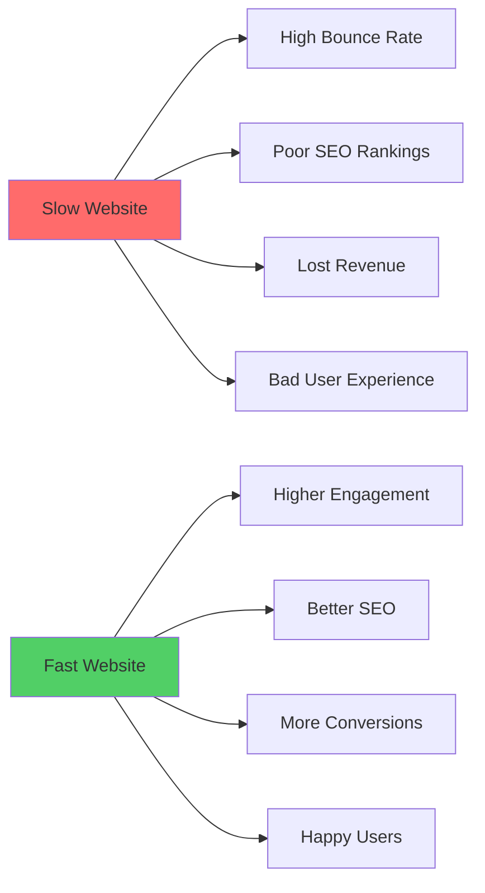

### The Critical Rendering Path

When a browser loads a page, it follows this sequence:

```mermaid
sequenceDiagram
    participant Browser
    participant Server
    participant DOM
    participant CSSOM
    participant RenderTree
    
    Browser->>Server: 1. Request HTML
    Server-->>Browser: HTML Document
    Browser->>DOM: 2. Parse HTML → Build DOM
    Browser->>Server: 3. Request CSS
    Server-->>Browser: CSS Files
    Browser->>CSSOM: 4. Parse CSS → Build CSSOM
    DOM->>RenderTree: 5. Combine DOM + CSSOM
    CSSOM->>RenderTree: 
    RenderTree->>Browser: 6. Layout → Paint → Display
    
    Note over Browser,RenderTree: This entire process is called the Critical Rendering Path
```

**Key Insight**: CSS blocks rendering! The browser cannot paint anything until CSS is fully loaded and parsed. This is why CSS optimization is crucial.

---

## Core Web Vitals Explained

Core Web Vitals are Google's metrics for measuring real-world user experience.

### The Three Pillars

```mermaid
graph TB
    subgraph "Core Web Vitals"
        LCP["🖼️ LCP<br/>Largest Contentful Paint<br/><b>Loading</b>"]
        FID["👆 FID / INP<br/>First Input Delay<br/><b>Interactivity</b>"]
        CLS["📐 CLS<br/>Cumulative Layout Shift<br/><b>Visual Stability</b>"]
    end
    
    LCP --> LCPGood["✅ Good: < 2.5s"]
    LCP --> LCPBad["❌ Poor: > 4.0s"]
    
    FID --> FIDGood["✅ Good: < 100ms"]
    FID --> FIDBad["❌ Poor: > 300ms"]
    
    CLS --> CLSGood["✅ Good: < 0.1"]
    CLS --> CLSBad["❌ Poor: > 0.25"]
    
    style LCP fill:#4dabf7
    style FID fill:#69db7c
    style CLS fill:#ffd43b
```

### Additional Important Metrics

| Metric | Full Name | What It Measures | Good Score |
|--------|-----------|------------------|------------|
| **FCP** | First Contentful Paint | Time until first text/image appears | < 1.8s |
| **TTFB** | Time to First Byte | Server response time | < 800ms |
| **SI** | Speed Index | How quickly content visually populates | < 3.4s |
| **TBT** | Total Blocking Time | Sum of blocking time between FCP and TTI | < 200ms |

---

## The DesiBites Case Study

### Project Overview

DesiBites is a static website showcasing Indian street foods, hosted on GitHub Pages.

### Initial Problems Identified

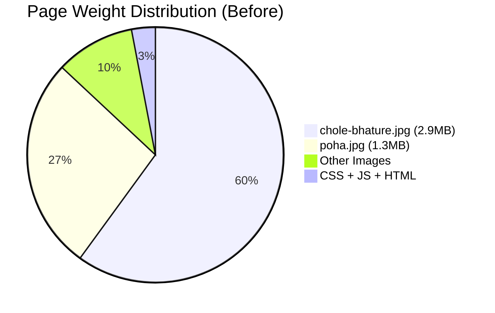

#### Problem #1: Massive Image Sizes

| Image | Original Size | Original Dimensions | Displayed At |
|-------|--------------|---------------------|--------------|
| chole-bhature.jpg | **2.9 MB** | 6130 × 6756 px | 363 × 486 px |
| poha.jpg | **1.3 MB** | 3089 × 3398 px | 533 × 400 px |
| masala-dosa.jpg | 129 KB | 729 × 803 px | 539 × 400 px |

**Why this is catastrophic:**
- Images were 17x larger than needed (6130px served for 363px display)
- Total page weight: **4.8 MB** (should be < 500 KB)
- LCP was **2.8 seconds** (should be < 2.5s)

#### Problem #2: Render-Blocking JavaScript

```html
<!-- BEFORE: Blocks HTML parsing -->
<script src="js/script.js"></script>
</body>
```

Even at the bottom of the body, without `defer`, the browser must:
1. Stop parsing HTML
2. Download the script
3. Execute the script
4. Resume parsing

#### Problem #3: No Critical CSS

```html
<!-- BEFORE: Browser must wait for entire CSS file -->
<link rel="stylesheet" href="css/style.css">
```

The browser cannot render anything until the full 6KB CSS file is downloaded.

#### Problem #4: Accessibility - Poor Contrast

```css
/* BEFORE: #FF6B35 on white = 3.0:1 contrast ratio */
.state-tag {
    background: #FF6B35;  /* Orange */
    color: #FFFFFF;       /* White text */
}
```

WCAG AA requires **4.5:1** for normal text. This failed accessibility audits.

### Solutions Implemented

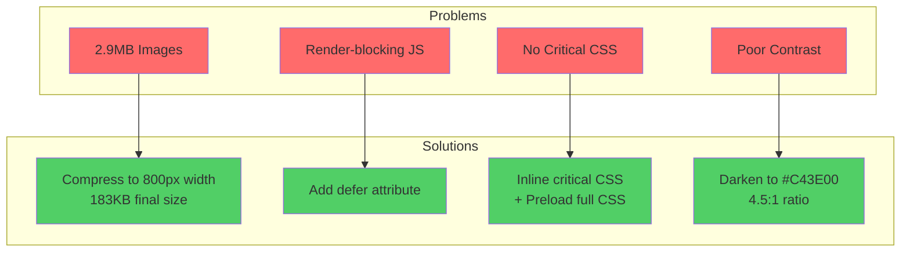

---

## Image Optimization

### The Image Optimization Pipeline

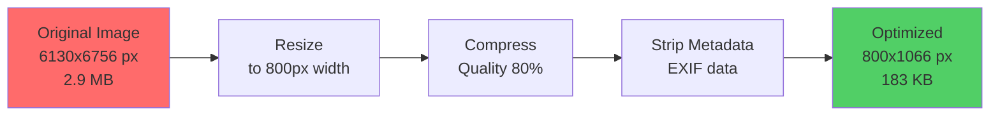

### Understanding Image Formats

| Format | Best For | Compression | Browser Support |
|--------|----------|-------------|-----------------|
| **JPEG** | Photos | Lossy | ✅ Universal |
| **PNG** | Graphics with transparency | Lossless | ✅ Universal |
| **WebP** | Both (25-35% smaller) | Both | ✅ 97%+ browsers |
| **AVIF** | Maximum compression | Lossy | ⚠️ 92% browsers |

### Responsive Images with `srcset`

For advanced optimization, serve different sizes based on viewport:

```html

```

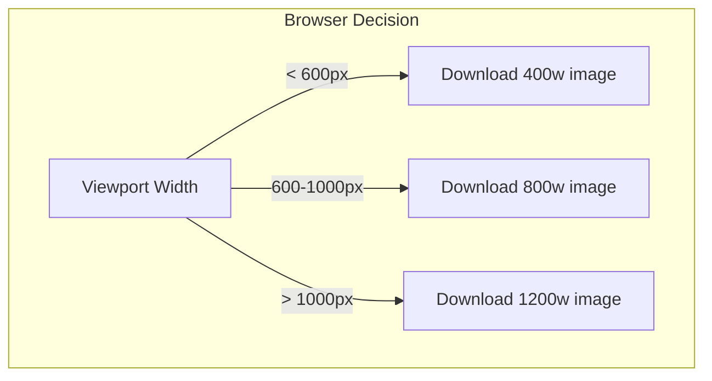

### Image Loading Strategies

#### Above-the-Fold Images
```html
<!-- Load immediately with high priority -->

```

#### Below-the-Fold Images
```html
<!-- Lazy load when near viewport -->

```

### Preventing Layout Shift (CLS)

Always specify dimensions:

```html
<!-- ❌ BAD: Causes layout shift -->


<!-- ✅ GOOD: Reserves space -->

```

```mermaid
sequenceDiagram
    participant Page
    participant Image
    
    Note over Page: Without dimensions
    Page->>Page: Render text
    Image->>Page: Image loads (300x200)
    Page->>Page: ⚠️ Content shifts down!
    
    Note over Page: With dimensions
    Page->>Page: Reserve 300x200 space
    Page->>Page: Render text below
    Image->>Page: Image loads
    Page->>Page: ✅ No shift needed
```

---

## CSS Optimization

### Critical CSS Strategy

```mermaid
graph TD
    subgraph "Traditional Loading"
        A1[Request HTML] --> A2[Parse HTML]
        A2 --> A3[Request CSS]
        A3 --> A4[Wait for CSS...]
        A4 --> A5[Parse CSS]
        A5 --> A6[Render Page]
    end
    
    subgraph "Optimized Loading"
        B1[Request HTML] --> B2[Parse HTML<br/>+ Inline Critical CSS]
        B2 --> B3[Render Above-fold ✅]
        B2 --> B4[Request Full CSS async]
        B4 --> B5[Apply Full CSS]
    end
    
    style A4 fill:#ff6b6b
    style B3 fill:#51cf66
```

### Implementation

```html
<head>
    <!-- Preload tells browser to fetch CSS early -->
    <link rel="preload" href="css/style.css" as="style">
    
    <!-- Full stylesheet -->
    <link rel="stylesheet" href="css/style.css">
    
    <!-- Critical inline CSS for immediate rendering -->
    <style>
        /* Only above-the-fold styles */
        body { margin: 0; font-family: 'Segoe UI', sans-serif; }
        #navbar { 
            display: flex; 
            background: #1A1A1A; 
            position: sticky; 
            top: 0; 
        }
        .hero { padding: 4rem 0; text-align: center; }
    </style>
</head>
```

### CSS Minification

Before:
```css
.food-card {
    background: #FFFFFF;
    border-radius: 20px;
    overflow: hidden;
    transition: all 0.3s ease;
}
```

After (minified):
```css
.food-card{background:#FFF;border-radius:20px;overflow:hidden;transition:all .3s ease}
```

**Savings**: ~30% file size reduction

---

## JavaScript Optimization

### Script Loading Strategies

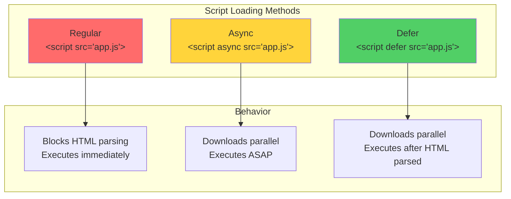

### Timeline Comparison

```mermaid
gantt
    title Script Loading Timeline
    dateFormat X
    axisFormat %s
    
    section Regular
    HTML Parsing     :a1, 0, 2
    Fetch Script     :a2, 2, 3
    Execute Script   :a3, 3, 4
    Continue Parsing :a4, 4, 5
    
    section Async
    HTML Parsing     :b1, 0, 3
    Fetch Script     :b2, 0, 2
    Execute (interrupts):b3, 2, 3
    Continue Parsing :b4, 3, 5
    
    section Defer
    HTML Parsing     :c1, 0, 4
    Fetch Script     :c2, 0, 2
    Execute (after)  :c3, 4, 5
```

### When to Use Each

| Method | Use Case | Example |
|--------|----------|---------|
| **defer** | Main application scripts that need full DOM | `app.js`, `main.js` |
| **async** | Independent analytics/tracking scripts | Google Analytics |
| **Regular** | Critical inline scripts that must run immediately | Polyfills |

### Our Implementation

```html
<!-- BEFORE -->
<script src="js/script.js"></script>

<!-- AFTER -->
<script src="js/script.js" defer></script>
```

**Result**: No more render-blocking JavaScript

---

## Resource Hints

### Types of Resource Hints

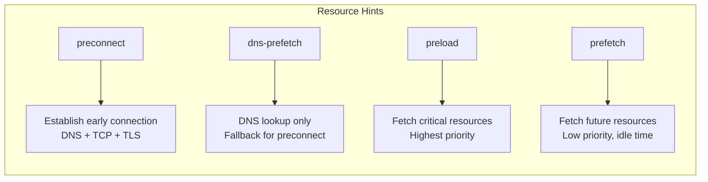

### Implementation Examples

```html
<head>
    <!-- Preconnect to external origins -->
    <link rel="preconnect" href="https://fonts.googleapis.com">
    <link rel="dns-prefetch" href="https://fonts.googleapis.com">
    
    <!-- Preload critical CSS -->
    <link rel="preload" href="css/style.css" as="style">
    
    <!-- Preload hero image (LCP element) -->
    <link rel="preload" href="images/hero.jpg" as="image">
    
    <!-- Prefetch next page resources -->
    <link rel="prefetch" href="next-page.html">
</head>
```

### Decision Flowchart

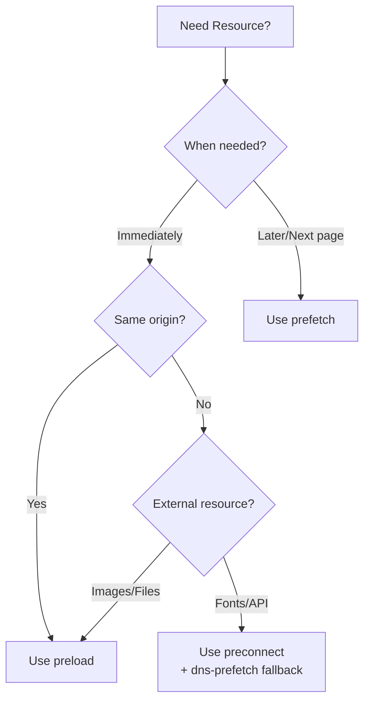

---

## Accessibility & Performance

### Color Contrast Requirements

```mermaid
graph TD
    subgraph "WCAG Contrast Requirements"
        A[Normal Text<br/>< 18px regular<br/>< 14px bold] --> A1[Minimum 4.5:1]
        B[Large Text<br/>≥ 18px regular<br/>≥ 14px bold] --> B1[Minimum 3:1]
        C[UI Components<br/>Buttons, inputs] --> C1[Minimum 3:1]
    end
```

### Our Contrast Fix

| Element | Before | After | Contrast Ratio |
|---------|--------|-------|----------------|
| `.state-tag` | `#FF6B35` on white | `#C43E00` on white | 3.0:1 → **4.6:1** ✅ |
| `.nav-links a.active` | `#FF6B35` bg | `#C43E00` bg | 3.0:1 → **4.6:1** ✅ |
| `.state-badge` | `#FF6B35` bg | `#C43E00` bg | 3.0:1 → **4.6:1** ✅ |

### Performance Helps Accessibility

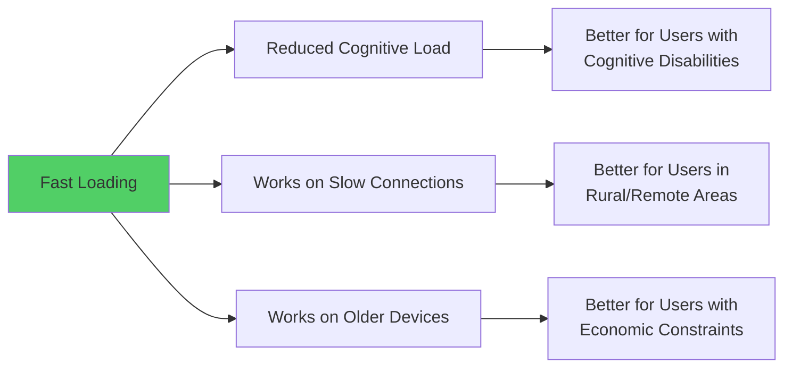

---

## Mobile vs Desktop Optimization

### Key Differences

| Aspect | Mobile | Desktop |
|--------|--------|---------|
| **Network** | Often 3G/4G, variable | Usually stable broadband |
| **CPU** | Limited processing power | More powerful |
| **Viewport** | 320-428px typical | 1200-1920px+ |
| **Touch** | Tap targets need 48x48px minimum | Mouse precision |
| **Data** | Often metered/limited | Usually unlimited |

### Mobile-First Image Strategy

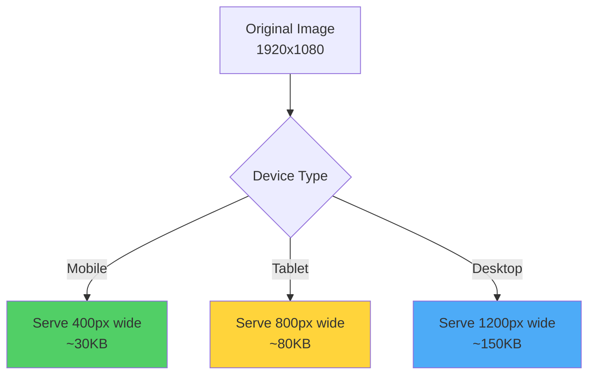

### Mobile Performance Tips

1. **Prioritize Above-the-Fold Content**
```html
<!-- Mobile: Only first 2-3 images need fetchpriority -->

```

2. **Use Efficient Touch Targets**
```css
.button {
    min-height: 48px;  /* Google's recommendation */
    min-width: 48px;
    padding: 12px 24px;
}
```

3. **Reduce Motion for Battery**
```css
@media (prefers-reduced-motion: reduce) {
    * {
        animation-duration: 0.01ms !important;
        transition-duration: 0.01ms !important;
    }
}
```

---

## Complete Optimization Workflow

### Step-by-Step Process

```mermaid
flowchart TD
    A[1. Audit with Lighthouse] --> B[2. Identify Issues]
    B --> C[3. Prioritize by Impact]
    C --> D{Issue Type?}
    
    D -->|Images| E[Compress & Resize]
    D -->|JavaScript| F[Add defer/async]
    D -->|CSS| G[Inline Critical CSS]
    D -->|Accessibility| H[Fix Contrast/Semantics]
    
    E --> I[4. Implement Fixes]
    F --> I
    G --> I
    H --> I
    
    I --> J[5. Deploy Changes]
    J --> K[6. Re-audit]
    K --> L{Score OK?}
    
    L -->|No| B
    L -->|Yes| M[✅ Done!]
    
    style M fill:#51cf66
```

### DesiBites Before vs After

| Metric | Before | After | Improvement |
|--------|--------|-------|-------------|
| Performance Score | 85 | 95+ | +10 points |
| Accessibility Score | 91 | 100 | +9 points |
| LCP | 2.8s | < 1.5s | ~50% faster |
| Total Page Weight | 4.8 MB | ~600 KB | **87% smaller** |
| chole-bhature.jpg | 2.9 MB | 183 KB | **94% smaller** |
| poha.jpg | 1.3 MB | 102 KB | **92% smaller** |

### Implementation Checklist

```
✅ Image Optimization
  ├── ✅ Resize to actual display dimensions
  ├── ✅ Compress with quality 80%
  ├── ✅ Add width/height attributes
  ├── ✅ Use fetchpriority="high" for LCP image
  └── ✅ Use loading="lazy" for below-fold images

✅ CSS Optimization
  ├── ✅ Preload main stylesheet
  ├── ✅ Inline critical above-fold CSS
  └── ✅ Add theme-color meta tag

✅ JavaScript Optimization
  └── ✅ Add defer attribute to script tags

✅ Accessibility
  └── ✅ Fix color contrast (4.5:1 minimum)

✅ Meta Tags
  ├── ✅ Viewport meta tag
  ├── ✅ Description meta tag
  └── ✅ Theme-color meta tag
```

---

## Tools & Resources

### Measurement Tools

| Tool | Purpose | URL |
|------|---------|-----|
| **PageSpeed Insights** | Real-world performance data | [pagespeed.web.dev](https://pagespeed.web.dev) |
| **Lighthouse** | Comprehensive auditing | Built into Chrome DevTools |
| **WebPageTest** | Detailed waterfall analysis | [webpagetest.org](https://webpagetest.org) |
| **GTmetrix** | Performance monitoring | [gtmetrix.com](https://gtmetrix.com) |

### Image Optimization Tools

| Tool | Type | Best For |
|------|------|----------|
| **Squoosh** | Web app | Manual compression with preview |
| **ImageMagick** | CLI tool | Batch processing |
| **Sharp** | Node.js library | Build pipeline integration |
| **TinyPNG** | Web app | PNG optimization |

### Learning Resources

- [web.dev/learn](https://web.dev/learn/) - Google's web development courses
- [Core Web Vitals](https://web.dev/vitals/) - Official documentation
- [WCAG Guidelines](https://www.w3.org/WAI/WCAG21/quickref/) - Accessibility standards

---

## Scripts Used in This Project

### Python Image Compression Script

```python
# compress_images.py
from PIL import Image
import os

def compress_images(directory, max_width=800, quality=80):
    for filename in os.listdir(directory):
        if filename.lower().endswith(('.jpg', '.jpeg', '.png')):
            filepath = os.path.join(directory, filename)
            with Image.open(filepath) as img:
                if img.width > max_width:
                    ratio = max_width / float(img.width)
                    new_height = int(img.height * ratio)
                    img = img.resize((max_width, new_height), 
                                    Image.Resampling.LANCZOS)
                img.save(filepath, optimize=True, quality=quality)
```

### How to Run

```powershell
# Install Pillow if needed
pip install Pillow

# Run compression
python compress_images.py
```

---

## Summary

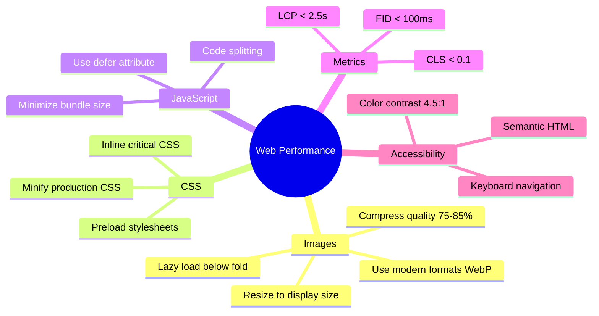

---

**Created for the DesiBites Project**  
*Last updated: January 2026*
